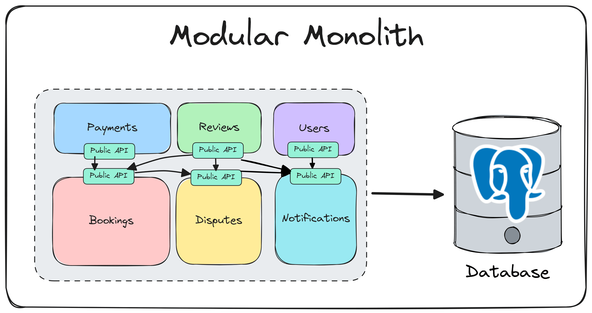

# Архитектура бэкенда

Бэкенд построен как [модульный монолит](https://habr.com/ru/companies/dododev/articles/650721/) — все компоненты разрабатываются в единой кодовой базе, но с чётким разделением на функциональные модули.

[](https://habr.com/ru/companies/dododev/articles/650721/)

## Структура бизнес-модулей

Каждый бизнес-модуль отражает конкретную функциональность, такую как управление пользователями или аутентификация.

```tree
module
├── __init__.py    # публичный API модуля
├── deps.py        # настройки зависимостей
├── fields.py      # переиспользуемые поля для Pydantic-схем
├── models.py      # SQLAlchemy ORM-модели
├── repository.py  # работа с базой данных (CRUD, нет бизнес-правил)
├── routes.py      # эндпоинты
├── schemas.py     # Pydantic-схемы
├── service.py     # бизнес-логика
└── validators.py  # валидаторы для полей и Pydantic-схем
```

> [!NOTE]
> При необходимости можно ввести свой под-модуль исходя из требований.
