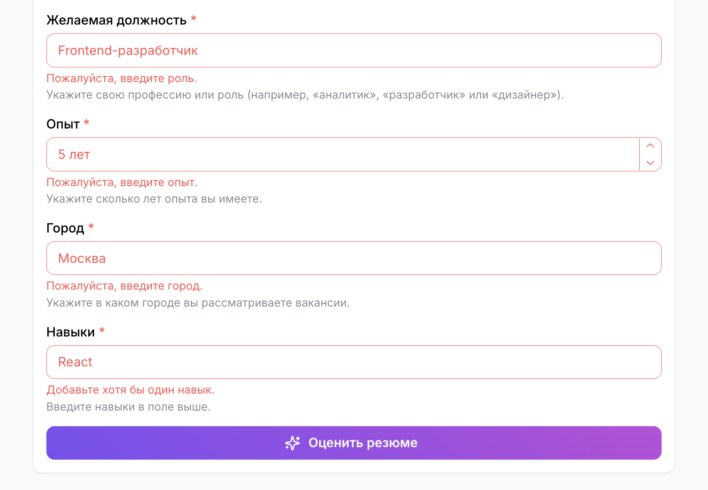
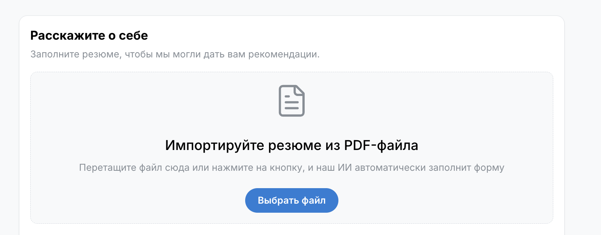
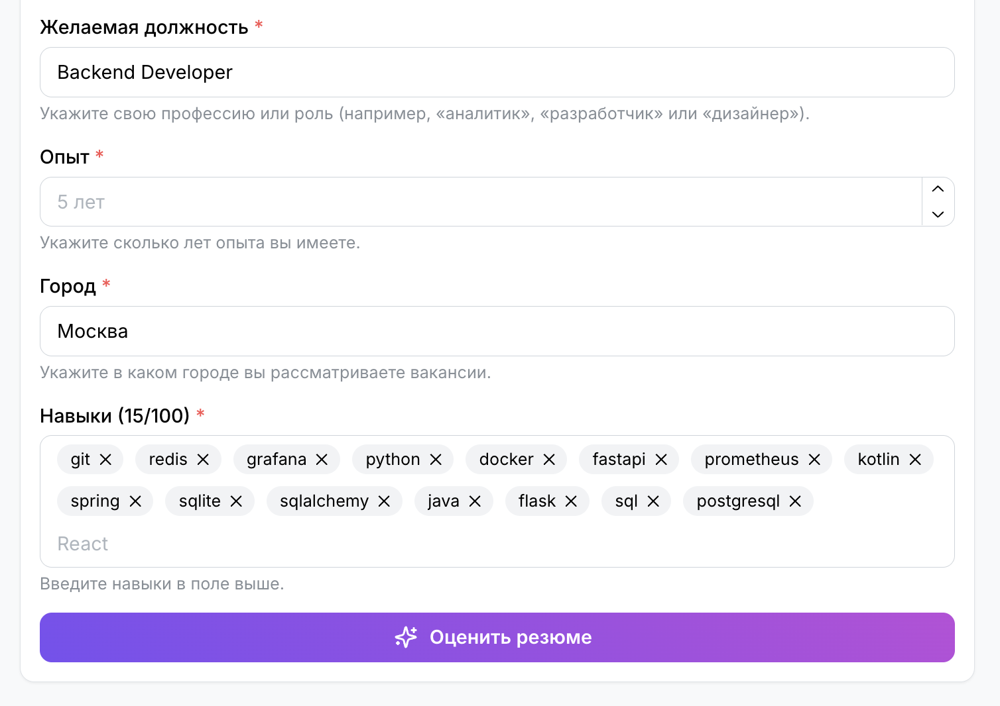
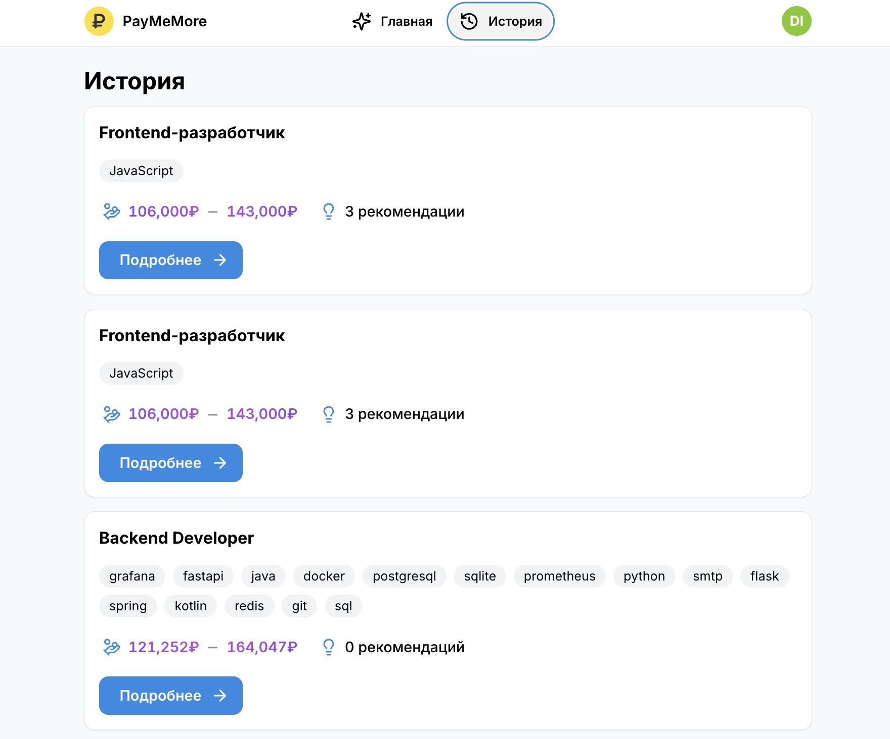
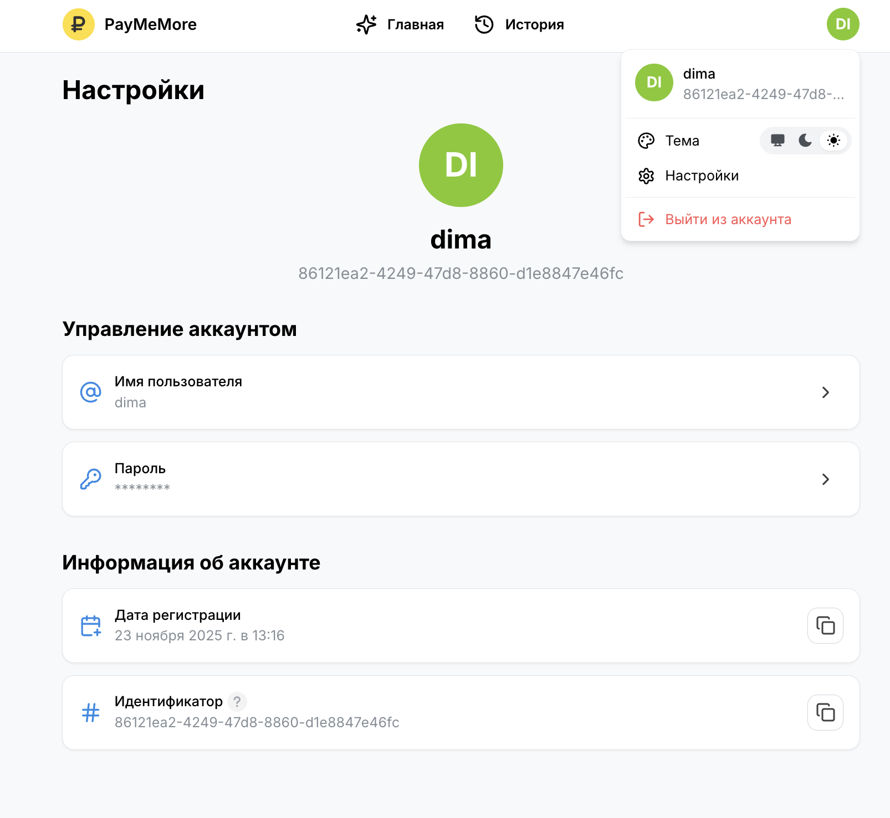

# Фронтенд

Клиентское веб-приложение на [React](https://react.dev).

## 👤 Пользовательские сценарии

### Основные

#### Первая оценка резюме и получение вилки

Пользователь может проскроллить до формы резюме или нажать на кнопку "Перейти к форме", после чего он заполняет резюме со следующими полями:

- Желаемая должность
- Опыт
- Город
- Навыки

Во время заполнения формы пользователю показываются подсказки и релевантные навыки для выбранной должности.

Форма полностью валидируется:

После заполнения формы пользователь нажимает на кнопку "Оценить резюме", после чего он видит индикаторы загрузки:

- Загрузка вилки
- Загрузка рекомендаций

#### Улучшение резюме исходя от полученной вилки и рекомендаций

Когда загрузилась вилка зарплаты, но рекомендации всё ещё загружаются, то пользователь всё равно может корректировать форму резюме и пересчитать вилку путём нажатия кнопки "Пересчитать" под формой резюме (тогда загрузка предыдущих рекомендаций отменяется и начинается новая).

Когда загрузились рекомендации, то пользователь видит несколько карточек с рекомендациями, где первая их них развёрнута.

Пользователь корректирует резюме, следуя рекомендациям. После чего он нажимает "Пересчитать" и вилка зарплаты возрастает.

### Дополнительные

#### Обратная связь по оценке резюме от ИИ

После загрузки вилки зарплаты и рекомендаций на рандомный раз оценки формы: первый, второй или третий, появляется карточка с просьбой поставить оценку от 1 до 5 работе сервиса:

После нажатия на определённую звёздочку пользователь получает сообщение об успешно отправленном отзыве и звёздочки закрашиваются:

#### Импорт резюме из PDF-файла

Пользователь может перетащить один файл на зону для загрузки PDF-файла перед формой резюме или нажать на кнопку и выбрать файл:

После завершения процесса импорта автоматически заполняются поля формы и пользователь может подкорректировать нужные поля и нажать кнопку "Оценить":

#### История оценок резюме

Пользователь может создать аккаунт на платформе или зайти в существующий, после чего автоматически все последующие оценки резюме будут сохранены в раздел "История" для этого пользователя:

#### Авторизация и профиль пользователя

Пользователь может менять юзернейм и пароль:

Можно поменять тему приложения на системную, тёмную, светлую.

Быстрый вход через тестовых пользователей:

Логин:

Регистрация:

## 🛠️ Технические детали

Чтобы ознакомиться с зависимостями, изучите файл [`package.json`](./package.json).

### Основные технологии

Mantine даёт очень много готовых компонентов, хуков и расширений, что делает разработку сфокусированной на функциональность и бизнес требования.

### Инструменты разработки

Rsbuild выбран так как он быстрее Vite. Biome аналогично быстрее Eslint + Prettier. Node.js является стандартным рантаймом, что снижает порог онбординга новых разработчиков в команду.

## 🏗️ Архитектура

Для детального обзора архитектуры этого сервиса ознакомьтесь с [`ARCHITECTURE.md`](./docs/ARCHITECTURE.md).

## 🤝 Участие в разработке

Если вы хотите сделать свой вклад в развитие этого сервиса, то ознакомьтесь с [`CONTRIBUTING.md`](./docs/CONTRIBUTING.md).
