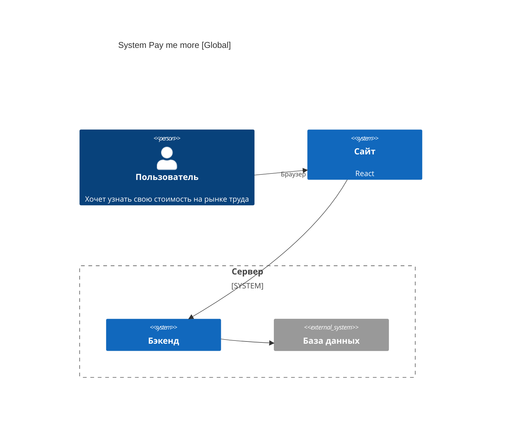
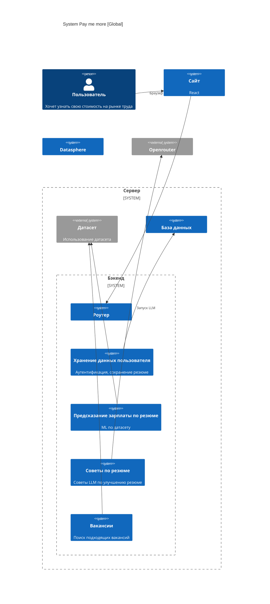

# C2

```mermaid
C4Context
title System Pay me more [Global]
Person(user, "Пользователь", "Хочет узнать свою стоимость на рынке труда")

System(frontend, "Сайт", "React")

System_Boundary(server, "Сервер") {
    System(backend, "Бэкенд", "")

    System_Ext(db, "База данных")
}


Rel(user, frontend, "Браузер")

Rel(frontend, backend, "")
%% Rel(backend, dataset, "")
Rel(backend, db, "")


%% Rel(SystemAA, SystemC, "Sends e-mails", "SMTP")
%% Rel(SystemC, customerA, "Sends e-mails to")

%% UpdateElementStyle(customerA, $fontColor="red", $bgColor="grey", $borderColor="red")
%% UpdateRelStyle(customerA, SystemAA, $textColor="blue", $lineColor="blue", $offsetX="5")
%% UpdateRelStyle(SystemAA, SystemE, $textColor="blue", $lineColor="blue", $offsetY="-10")
%% UpdateRelStyle(SystemAA, SystemC, $textColor="blue", $lineColor="blue", $offsetY="-40", $offsetX="-50")
%% UpdateRelStyle(SystemC, customerA, $textColor="red", $lineColor="red", $offsetX="-50", $offsetY="20")

UpdateLayoutConfig($c4ShapeInRow="2", $c4BoundaryInRow="1")
```

# C3

```mermaid
C4Context
title System Pay me more [Global]
Person(user, "Пользователь", "Хочет узнать свою стоимость на рынке труда")

System(frontend, "Сайт", "React")

System_Boundary(server, "Сервер") {
    System_Boundary(backend, "Бэкенд") {
        System(main_back, "Роутер", "")
        System(auth, "Хранение данных пользователя", "Аутентификация, сохранение резюме")
        System(wage, "Предсказание зарплаты по резюме", "ML по датасету")
        System(suggestions, "Советы по резюме", "Советы LLM по улучшению резюме ")
        System(jobs, "Вакансии", "Поиск подходящих вакансий")

        Rel(wage, dataset, "")
        Rel(jobs, dataset, "")
    }

    System_Ext(dataset, "Датасет", "Использование датасета")

    System(db, "База данных")
}

System(datasphere, "Datasphere", "")
System_Ext(openrouter, "Openrouter", "")

Rel(user, frontend, "Браузер")

Rel(frontend, main_back, "")

Rel(auth, db, "")

Rel(suggestions, openrouter, "Запуск LLM")
%% Rel(main_back, auth, "")
%% Rel(main_back, wage, "")
%% Rel(main_back, suggestions, "")
%% Rel(main_back, jobs, "")

UpdateLayoutConfig($c4ShapeInRow="2", $c4BoundaryInRow="1")
```